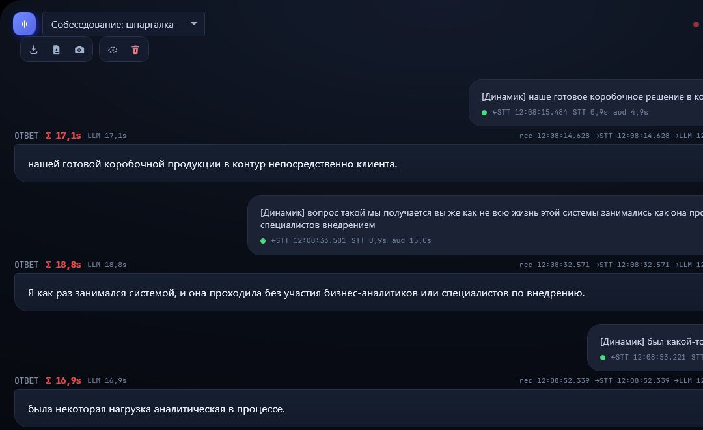
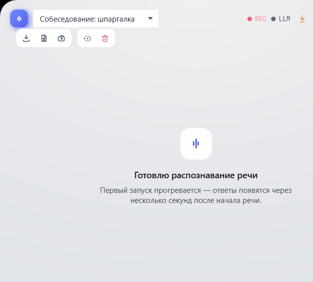
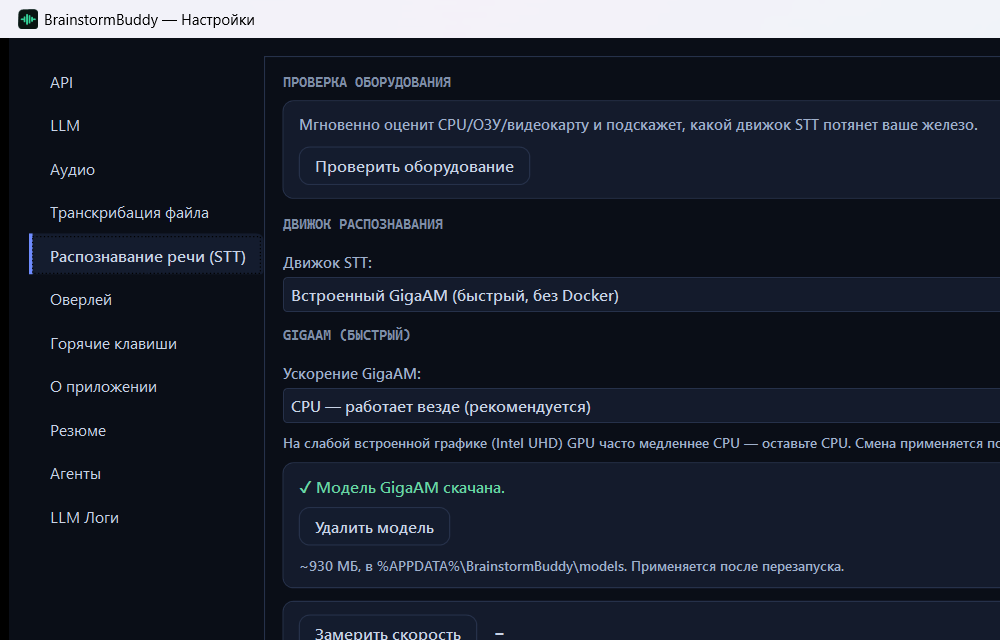
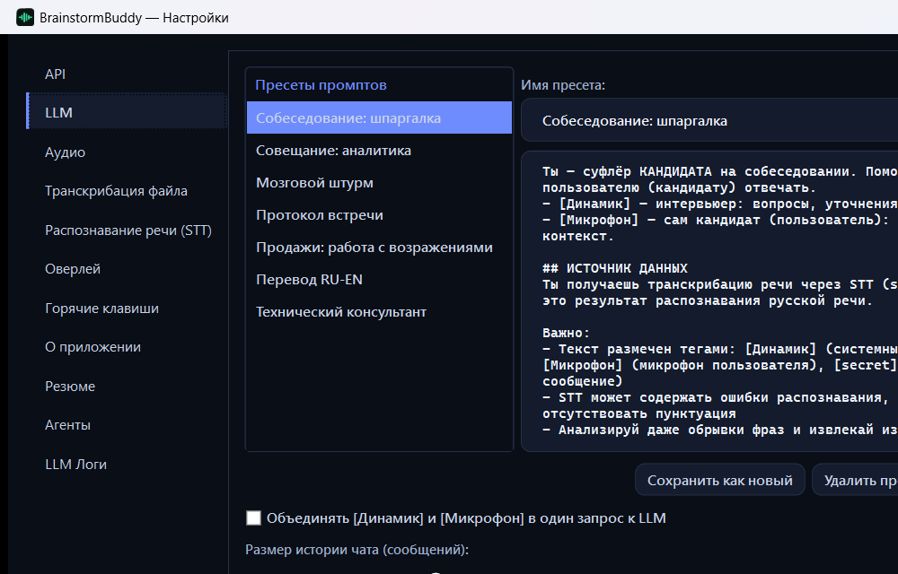
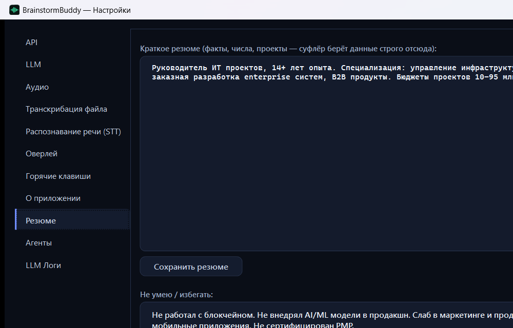
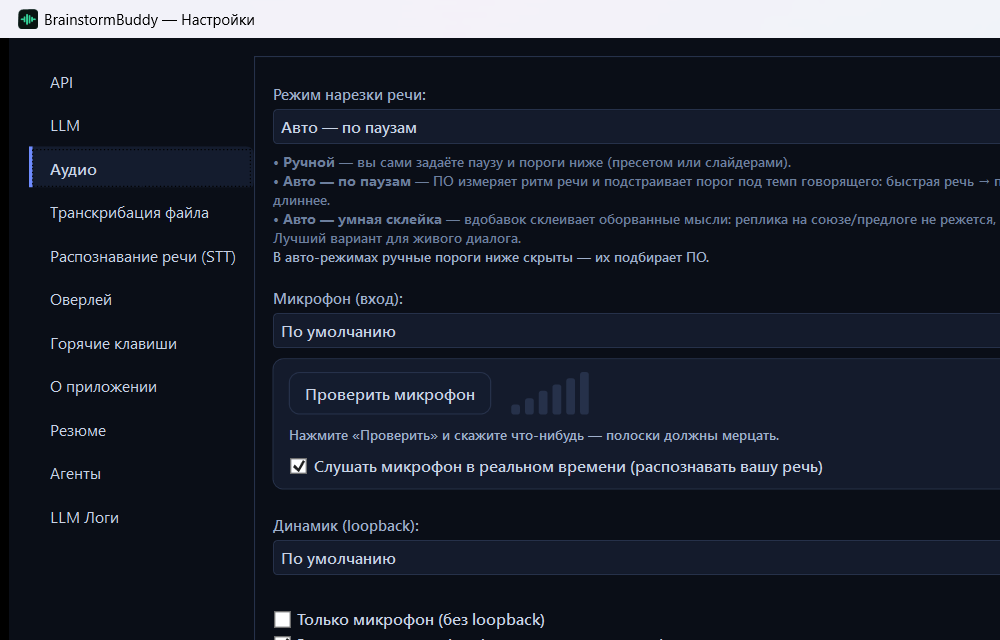
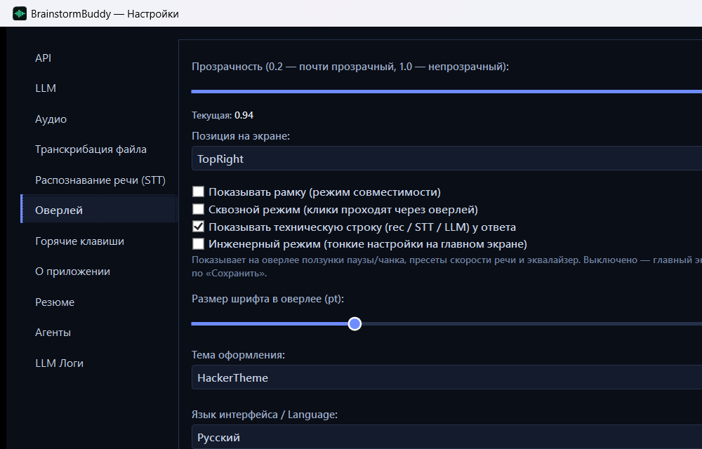
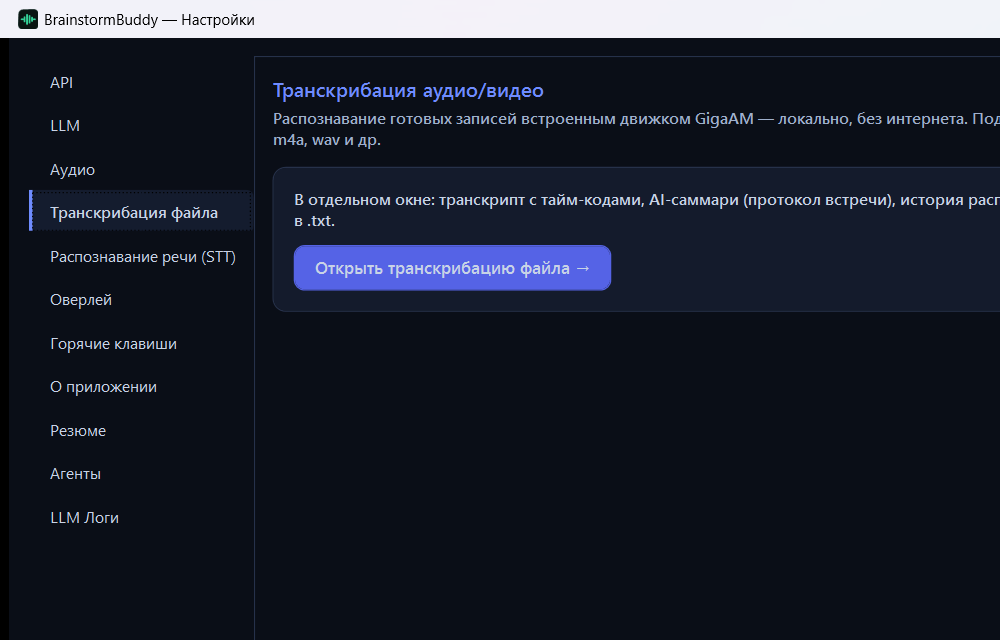

<div align="center">

# 🧠 BrainstormBuddy

### Невидимый ассистент для живых созвонов

**Подсказывает готовые ответы прямо во время собеседования, продажи или переговоров. Оверлей поверх экрана, который не видно ни в Zoom, ни в записи. Работает офлайн на вашем компьютере или с вашим сервером — как захотите.**



<sub>Справа реальные вопросы, распознанные из звонка. Слева готовые ответы от ИИ. Всё это видите только вы.</sub>

   

</div>

---

## Зачем это нужно

Собеседование, звонок с клиентом, сложные переговоры. Вопрос застаёт врасплох, и пара секунд молчания решает исход. Гуглить некогда, а платные сервисы присылают саммари уже **после** встречи, когда поздно.

BrainstormBuddy работает в реальном времени и остаётся невидимым. Он слушает разговор, распознаёт речь собеседника и за секунды кладёт вам на экран готовый ответ, сформулированный по вашему резюме. Собеседник запросил демонстрацию вашего экрана? Подсказки он не увидит: оверлей исключён из захвата на уровне системы (Zoom, Teams, Google Meet, Яндекс Телемост, OBS, скриншот).

Всё распознавание и вся генерация могут идти прямо на вашем компьютере, без облака. А если нужна максимальная скорость и качество, приложение подключается к любому внешнему серверу распознавания и к любой языковой модели. Выбор за вами.

## Что делает его особенным

- 🥷 **Невидим для записи и демонстрации экрана.** Оверлей исключён из захвата на уровне ОС, поэтому на созвоне и на скриншоте собеседника его нет. Одна кнопка (или `Ctrl+Shift+C`) убирает его даже для вас, если хотите сами что-то заскринить.
- ⚡ **Подсказка в реальном времени, а не протокол после встречи.** Вопрос прозвучал, и через пару секунд готовая реплика уже на экране. Формат STAR для проектных вопросов, короткая суть для теоретических.
- 🔒 **По умолчанию ничего не уходит в облако.** Распознавание речи (GigaAM или Whisper) и языковая модель (Ollama) работают локально. При желании подключаете свой внешний STT и любую облачную LLM.
- 🎯 **Ответы по вашему резюме, без выдумок.** Ассистент берёт факты, проекты и цифры строго из вашего профиля. Не знает ответа, честно молчит, а не сочиняет опыт.
- 🎙️ **Сам отделяет вас от собеседника.** Системный звук (собеседник) и микрофон (вы) идут разными каналами, поэтому ИИ понимает, кто задал вопрос.
- 🧩 **Любой движок распознавания с авто-переключением.** Встроенный GigaAM (быстрый, русский, без Docker), Whisper large-v3 (точность и пунктуация, лучше на видеокарте), локальный Docker-сервер или свой внешний сервер. Один недоступен, приложение само переключается на другой.
- 🌍 **Русский и английский.** GigaAM заточен под русскую речь. Нужен английский или смешанный язык, выбираете Whisper и получаете распознавание английского.
- 🎛️ **Умная нарезка речи.** Авто-режим подстраивает паузу под темп говорящего, не рубит фразу на полуслове и не тормозит.

## Как это выглядит

| Живой ассистент (тёмная тема) | Светлая тема |
|:---:|:---:|
|  |  |

## Как это работает

```
🎧 Звук собеседника (loopback)  ┐
🎤 Ваш микрофон                 ┘→  нарезка речи  →  распознавание  →  ассистент  →  🫥 оверлей (только для вас)
```

1. Приложение слушает системный звук и микрофон двумя раздельными каналами.
2. Речь нарезается по паузам (порог подстраивается автоматически) и уходит в распознавание.
3. Распознанный вопрос собеседника попадает в ассистента, который формулирует готовую реплику по вашему резюме.
4. Ответ появляется на прозрачном оверлее поверх всех окон, невидимом для записи экрана.

## Скачать и установить

> ### 👉 [Скачать со страницы релизов](https://github.com/liveinno/brainstorm-buddy/releases)

Есть две версии установщика — выберите одну:

| Версия | Что внутри | Размер |
|---|---|---|
| **`BrainstormBuddy-Setup-Full.exe`** (рекомендуется) | Приложение + офлайн-модели **GigaAM и Whisper** — всё работает без интернета сразу, включая транскрибацию файлов и английский | ~1 ГБ |
| **`BrainstormBuddy-Setup-Lite.exe`** | Приложение + **GigaAM** (живой ассистент офлайн). Whisper докачивается при первом использовании транскрибации файлов | ~0.5 ГБ |

1. Откройте страницу релизов по ссылке выше.
2. Скачайте **Full** (всё офлайн) или **Lite** (легче, докачает Whisper при необходимости).
3. Запустите скачанный файл. Если Windows покажет синее окно SmartScreen, нажмите **«Подробнее» → «Выполнить в любом случае»** (это нормально для приложений без платной подписи издателя).
4. Пройдите мастер установки (Далее, Далее, Установить). Ярлык появится на рабочем столе и в меню Пуск.
5. Запустите приложение и пройдите короткое обучение внутри.

Удаление стандартное: **Параметры Windows → Приложения → BrainstormBuddy → Удалить**, либо ярлык «Удалить» в меню Пуск. Ваши настройки и сохранённые файлы при удалении не трогаются.

<details>
<summary>Сборка из исходников (для разработчиков)</summary>

```bash
dotnet restore
dotnet build -c Release
dotnet publish BrainstormBuddy/BrainstormBuddy.csproj -c Release -r win-x64 --self-contained true -o publish/
```

Для локальной языковой модели поставьте [Ollama](https://ollama.com) и скачайте модель: `ollama pull qwen2.5vl:7b`.

Сборка установщиков (Lite и Full, Inno Setup):

```bash
bash packaging/build-installer.sh   # → installer-inno/BrainstormBuddy-Setup-{Lite,Full}.exe
```

Перед этим положите модель GigaAM в `artifacts/gigaam/v2_ctc.onnx` (как получить её из первоисточника — [`tools/gigaam_export`](tools/gigaam_export)): каталог `artifacts/` в git не хранится. Детали и грабли — в [`docs/INSTALLER.md`](docs/INSTALLER.md).
</details>

## 🔐 Откуда модели и как проверить

Обе модели распознавания взяты из официальных открытых источников с лицензией MIT. Полный список компонентов и лицензий — в [`THIRD-PARTY-NOTICES.txt`](THIRD-PARTY-NOTICES.txt).

| Модель | Официальный источник | Лицензия |
|---|---|---|
| **GigaAM v2 (CTC)** — русское распознавание, живой ассистент | [github.com/salute-developers/GigaAM](https://github.com/salute-developers/GigaAM) (SberDevices) | MIT |
| **Whisper large-v3-turbo (ggml, q5_0)** — транскрибация файлов, английский | [huggingface.co/ggerganov/whisper.cpp](https://huggingface.co/ggerganov/whisper.cpp/blob/main/ggml-large-v3-turbo-q5_0.bin) | MIT |

Приложение **ничего не докачивает в фоне без вашего ведома**: в версии Full обе модели уже в комплекте, в Lite Whisper скачивается напрямую с HuggingFace только по кнопке в настройках (адрес виден в приложении и в исходном коде).

Как проверить самостоятельно:

- **Контрольные суммы.** На [странице релиза](https://github.com/liveinno/brainstorm-buddy/releases) публикуется `SHA256SUMS.txt` с хэшами установщиков и моделей. Модели после установки лежат в папке приложения, подпапка `models` (по умолчанию `%LOCALAPPDATA%\Programs\BrainstormBuddy\models`). Хэш любого файла: `Get-FileHash "<путь>" -Algorithm SHA256` в PowerShell.
- **Whisper** — в точности официальный файл с HuggingFace: хэш сверяется прямо со страницей модели (HF показывает SHA256 у каждого файла).
- **GigaAM** — ONNX-экспорт официальной модели Сбера, сделанный открытым скриптом из этого же репозитория: [`tools/gigaam_export`](tools/gigaam_export). Готовый ONNX Сбер не публикует, поэтому внешнего «эталона» не существует — зато экспорт воспроизводим: поставьте официальный pip-пакет `gigaam`, прогоните наш скрипт и получите ту же модель напрямую из первоисточника.

## Настройки

Всё настраивается через **Настройки** (`Ctrl+Shift+S`). Ниже разделы, которые стоит знать.

### Распознавание речи (STT)



Главный выбор движка. **Из коробки работает «Встроенный GigaAM»**: быстрый, русский, без интернета и без Docker, модель уже входит в установку. Whisper large-v3 точнее и добавляет пунктуацию и английский, но тяжелее (лучше на видеокарте). Ещё есть локальный Docker-сервер и свой внешний сервер. Кнопка **«Замерить скорость»** покажет, как быстро распознаёт речь именно ваше железо.

### LLM (языковая модель)



Здесь выбирается мозг ассистента и пресеты под сценарий (Собеседование, Совещание, Продажи, Мозговой штурм, Перевод и другие).

> **⚠️ Важно про модель.** Встроенная локальная модель (`qwen2.5vl:7b`) хороша для приватности и знакомства, но на обычном ноутбуке она думает дольше и отвечает проще. **Для боевого собеседования подключите сильную «flash» модель через быстрый облачный провайдер: ответы станут точнее и приходят за 1–2 секунды.** Снимите розовые очки: маленькая локальная модель это компромисс ради приватности, а не топ качества.

### Резюме



Ваш профиль: опыт, проекты, цифры, а также чего избегать. Ассистент берёт факты строго отсюда, поэтому чем подробнее заполните, тем точнее и честнее ответы.

### Аудио



Режим нарезки речи (ручной или авто, с умной склейкой оборванных мыслей), выбор микрофона и системного звука, тест микрофона.

### Оверлей



Прозрачность, позиция, размер шрифта, тема (тёмная или светлая), язык интерфейса. Тут же **инженерный режим**: по умолчанию выключен, и главный экран остаётся чистым. Включите, если хотите видеть тонкие ползунки и эквалайзер.

## Транскрибация готовых записей



Помимо живого ассистента есть отдельный режим для уже записанных встреч. Приложение распознаёт готовые аудио и видео (mp4, m4a, wav, webm и другие) встроенным движком GigaAM, локально и без интернета. В отдельном окне вы получаете полный транскрипт с тайм-кодами, AI-саммари в виде протокола встречи, историю распознаваний и экспорт в `.txt`. Там же выбирается оборудование распознавания: авто, процессор или конкретная видеокарта. Открывается из **Настройки → «Транскрибация файла»**.

## Приватность

По умолчанию ничего не уходит наружу, пока вы сами не укажете внешний сервер или облачную модель. Локальный режим держит и звук, и распознавание, и генерацию на вашем компьютере. Экспорт транскриптов и протоколов идёт в вашу папку «Документы».

## Горячие клавиши

| Клавиши | Действие |
|---|---|
| `Ctrl+Shift+H` | Показать или скрыть оверлей |
| `Ctrl+Shift+C` | Режим скриншота (показать оверлей для записи и обратно) |
| `Ctrl+Shift+S` | Открыть настройки |
| `Ctrl+Shift+O` | Изменить прозрачность |
| `Ctrl+Shift+P` | Пауза аудио |
| `Ctrl+Shift+Y` | Пауза ИИ |

## Системные требования

Windows 10 (build 18362 и новее) или Windows 11. Микрофон и системный звук. Для локальной языковой модели [Ollama](https://ollama.com). Для GPU-ускорения Whisper дискретная видеокарта.

## Лицензия

MIT: свободное использование, изменение и распространение (в том числе коммерческое) при сохранении текста лицензии и копирайта. См. [`LICENSE`](LICENSE).

## Стек

C# 12 · .NET 8 · WPF · NAudio · ONNX Runtime (GigaAM) · whisper.cpp · Ollama · OpenAI-совместимый HTTP.
